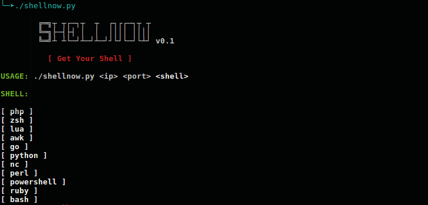

# shellnow
Generador reverse shell simple que va al grano.
Si estas apurado y nesecitas generar una reverse shell con un lenguaje o herramienta en especifico
shellnow es tu herramienta.

No nesecitas instalar librerias, solo necesitas Python3 y estara listo para correr en tu sistema.

## Preview


## Uso

```./shellnow <host ip> <port> <shell>```

**Ejemplo...**

```./shellnow 127.0.0.1 9595 python```

## Shell habilitados
- **php**
- **zsh**
- **lua**
- **awk**
- **go**
- **python**
- **nc**
- **perl**
- **powershell**
- **ruby**
- **bash**

**Bye and Happy Hacking!!**
